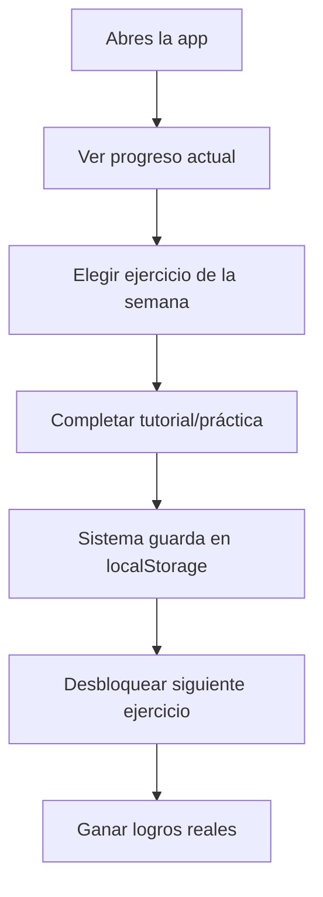

# 🏗️ ARQUITECTURA REAL DEL PROYECTO - ORQUESTACIÓN DE AGENTES IA

> **⚠️ IMPORTANTE**: Este documento explica la arquitectura REAL del proyecto para evitar confusiones con datos de prueba vs datos reales.

---

## 🎯 **OBJETIVO REAL DEL PROYECTO**

### **¿Qué ES realmente?**
**Plataforma de auto-formación personal de 48 semanas (52 con vacaciones)** para crear tu propia agencia digital con IA.

- **Usuario**: TÚ (uso personal/profesional)
- **Propósito**: Aprender a construir sistemas de agentes IA desde cero hasta nivel profesional y de doctorado.
- **Duración**: 48 semanas efectivas + 4 semanas de vacaciones = 1 año completo
- **Modalidad**: Auto-aprendizaje con tutoriales interactivos y recursos sugeridos.

### **¿Qué NO ES?**
- ❌ No es una plataforma comercial para terceros
- ❌ No es un curso con múltiples estudiantes
- ❌ No usa Supabase (todo es local)
- ❌ No hay backend externo real de producción

---

## 🏢 **ESTRUCTURA REAL DE DATOS**

### **📊 DATOS REALES vs DATOS DE PRUEBA**

#### **✅ DATOS REALES (Persistentes)**
```typescript
// Ubicación: localStorage del navegador
interface ProgresoReal {
  semanaActual: number          // Tu progreso real
  ejerciciosCompletados: string[] // Tus ejercicios reales
  logrosDesbloqueados: LogroAcademia[] // Tus logros reales
  tiempoInvertido: number       // Tiempo real de estudio
  configuracion: ConfigUsuario   // Tus preferencias reales
}
```

#### **🧪 DATOS DE PRUEBA (Mock/Demo)**
```typescript
// ClaudeFlowAcademia.ts - Línea 72
private mockMode: boolean = true // ⚠️ SIEMPRE EN MODO DEMO

// SistemaProgreso.ts - localStorage
// Los ejercicios, estadísticas y progreso son reales
// Solo las evaluaciones de IA están en modo mock
```

---

## 🗄️ **BASE DE DATOS REAL**

### **Frontend (Puerto 3000)**
```javascript
// Ubicación: localStorage del navegador
- Progreso del usuario (real)
- Configuraciones (reales)
- Ejercicios completados (reales)
- Tiempo de estudio (real)
```

### **Backend mi-agencia-ia (Puerto 3001)**
```javascript
// Ubicación: SQLite local + Memoria
- ./mi-agencia-ia/database/agency.db (SQLite)
- Tasks de agentes (reales durante desarrollo)
- Historial de interacciones (real durante pruebas)
- Cache de prompts (real)
```

### **🔍 DÓNDE EDITAR LOS DATOS**

#### **1. Progreso Personal**
```typescript
// Archivo: src/lib/academia/SistemaProgreso.ts
// Línea: ~40-100 (configuración inicial)
export class SistemaProgreso {
  private readonly PROGRESO_INICIAL: ProgresoUsuario = {
    semanaActual: 1,        // ⬅️ TU SEMANA ACTUAL
    puntosTotal: 0,         // ⬅️ TUS PUNTOS
    racha: 0,              // ⬅️ TU RACHA DE DÍAS
    // ... edita aquí tu progreso inicial
  }
}
```

#### **2. Contenido de Semanas**
```typescript
// Archivo: src/lib/academia/SistemaProgreso.ts  
// Línea: ~200-300 (ejercicios por semana)
private readonly ejerciciosPorSemana: Record<number, any[]> = {
  1: [
    { id: 'setup-inicial', titulo: 'Setup Inicial' },
    // ⬅️ AGREGA/EDITA ejercicios de la semana 1
  ],
  2: [
    // ⬅️ AGREGA/EDITA ejercicios de la semana 2
  ]
}
```

#### **3. Tutoriales y Contenido**
```typescript
// Archivo: src/app/tutoriales/page.tsx
// Línea: ~20-50 (configuración de tutoriales)
const tutorialesPorCategoria = {
  fundamentos: [
    // ⬅️ AGREGA/EDITA tutoriales básicos
  ],
  avanzados: [
    // ⬅️ AGREGA/EDITA tutoriales avanzados
  ]
}
```

---

## 🎛️ **CONFIGURACIÓN TEMPORAL**

### **Cambiar de Mock a Producción**
```typescript
// Archivo: src/lib/academia/ClaudeFlowAcademia.ts
// Línea: 72
private mockMode: boolean = false // ⬅️ Cambiar a false para APIs reales

// Archivo: src/lib/academia/ClaudeFlowAcademia.ts  
// Línea: 74
constructor(mockMode: boolean = false) { // ⬅️ Cambiar default
  this.mockMode = mockMode
}
```

### **APIs Reales que se Activarían**
```typescript
// Se activarían cuando mockMode = false
- OpenAI API (para evaluaciones reales)
- Anthropic Claude (para feedback avanzado)  
- Embeddings (para búsqueda semántica)
```

---

## 📁 **ESTRUCTURA DE ARCHIVOS CLAVE**

### **🎯 Progreso Real del Usuario**
```
src/lib/academia/
├── SistemaProgreso.ts          # ⭐ TU PROGRESO REAL
├── ClaudeFlowAcademia.ts       # ⚠️ Mock de IA (provisional)
└── datos-mock.ts               # 🧪 Datos de demostración
```

### **🏗️ Sistema de Agentes (mi-agencia-ia)**
```
mi-agencia-ia/src/
├── server.js                   # 🔧 Motor real de agentes
├── simple-server.js            # 🧪 Demo básica
└── core/
    ├── taskValidator.js        # ✅ Validación real
    └── agents/                 # 🤖 Agentes especializados
```

### **🎨 Frontend Interface**
```
src/app/
├── agencia/                    # 🏢 Panel de agencia (futuro)
├── playground/                 # 🧪 Zona de pruebas
└── tutoriales/                 # 📚 Contenido educativo (real)
```

---

## 🔄 **FLUJO REAL DE TRABAJO**

### **Tu Jornada Típica**


### **Datos que se Persisten**
- ✅ Tu progreso semanal
- ✅ Ejercicios completados
- ✅ Tiempo invertido por día  
- ✅ Configuraciones personales
- ✅ Logros desbloqueados

### **Datos Temporales (Mock)**
- 🧪 Evaluaciones de código con IA
- 🧪 Feedback automático de ejercicios
- 🧪 Análisis de rendimiento con IA

---

## 🛠️ **CÓMO DESARROLLAR NUEVAS FUNCIONES**

### **1. Agregar Nueva Semana**
```typescript
// Paso 1: src/lib/academia/SistemaProgreso.ts
// Agregar ejercicios en ejerciciosPorSemana[X]

// Paso 2: Crear página
// src/app/agencia/mes-X/semana-X/page.tsx

// Paso 3: Agregar ruta en MenuLateral.tsx
```

### **2. Conectar API Real de IA**
```typescript
// Paso 1: Cambiar mockMode = false
// Paso 2: Configurar API keys en .env.local
// Paso 3: Implementar métodos reales en ClaudeFlowAcademia.ts
```

### **3. Expandir Sistema de Agentes**
```typescript
// Paso 1: Crear nuevo agente en mi-agencia-ia/src/core/agents/
// Paso 2: Registrar en server.js
// Paso 3: Crear endpoints API correspondientes
```

---

## ⚠️ **LIMITACIONES ACTUALES**

### **Lo que Funciona 100%**
- ✅ Sistema de progreso personal
- ✅ Tutoriales interactivos
- ✅ Navegación entre semanas
- ✅ Persistencia local (localStorage)
- ✅ Sistema de logros

### **Lo que está en Demo/Mock**
- 🧪 Evaluaciones automáticas de código
- 🧪 Feedback inteligente de IA
- 🧪 Análisis de complejidad de tareas
- 🧪 Optimización automática de prompts

### **Lo que Falta Implementar**
- 🔄 Conexión real con APIs de IA
- 🔄 Sistema de backup en la nube (opcional)
- 🔄 Métricas avanzadas de rendimiento
- 🔄 Sistema de exportar/importar progreso

---

## 🎯 **PRÓXIMOS PASOS RECOMENDADOS**

1. **Completar Semana 1-4** usando el sistema actual
2. **Documentar tu experiencia** real de aprendizaje  
3. **Decidir qué APIs conectar** primero (OpenAI vs Claude)
4. **Implementar persistencia en la nube** si necesitas backup
5. **Expandir el contenido** de las semanas 5-12 basado en tu progreso

---

**💡 RESUMEN**: Es tu plataforma personal de auto-formación con datos reales de progreso pero evaluaciones mock. El valor está en el contenido estructurado y el sistema de seguimiento, no en la IA (que es temporal hasta que conectes APIs reales).
