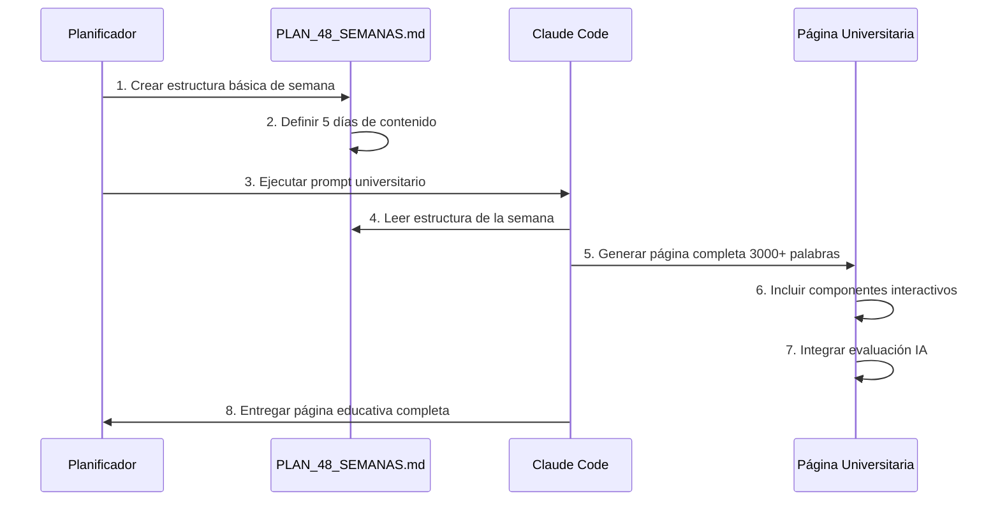

# 🎓 **PLANTILLA OFICIAL: Creación de Contenido Educativo**

## 📋 **PASO 1: Planificación en PLAN_48_SEMANAS.md**

### **Formato Estándar:**
```markdown
#### ✅ **Tarea FX-MX-SX: [TÍTULO DE LA SEMANA]**
*[Contexto/conexión con contenido actual]*

**🎯 Objetivo**: [Objetivo específico y medible]

**📚 Contenido a expandir**:
- **Día 1**: [Concepto base] + [Aplicación práctica]
- **Día 2**: [Concepto intermedio] + [Implementación]
- **Día 3**: [Concepto avanzado] + [Integración]
- **Día 4**: [Concepto especializado] + [Optimización]
- **Día 5**: [Síntesis] + [Preparación siguiente tema]

**🔧 Tecnologías**: [Lista de tecnologías específicas]
**📦 Entregables**: [Código funcional] + [Tests] + [Documentación]
```

### **Ejemplo Completo:**
```markdown
#### ✅ **Tarea F1-M1-S1: Configuración del Entorno y Fundamentos**
*Expansión del contenido actual de Semana 1*

**🎯 Objetivo**: Establecer base sólida de desarrollo y principios fundamentales

**📚 Contenido a expandir**:
- **Día 1**: Setup inicial del proyecto + Principios de Clean Code
- **Día 2**: Estructura de directorios + Configuración de Git
- **Día 3**: Crear task.schema.json + Validación de datos
- **Día 4**: Tests básicos con Jest + Primer agente mock
- **Día 5**: Integración y documentación JSDoc

**🔧 Tecnologías**: Node.js, Git, Jest, JSON Schema, JSDoc
**📦 Entregables**: Proyecto configurado + Schema + Tests básicos
```

---

## 🎓 **PASO 2: Expansión Universitaria con Claude Code**

### **Comando de Ejecución:**
```bash
# En tu terminal
claude-code "Crear página educativa universitaria para [TAREA-ID] 
siguiendo PROMPT_EJECUTABLE_CLAUDE_CODE.md con nivel de detalle 
universitario, 3000+ palabras, 4 ejemplos progresivos, componentes 
interactivos y evaluación IA integrada"
```

### **Estructura de Página Generada:**
```tsx
// src/app/agencia/mes-X/semana-Y/dia-Z/page.tsx
export default function FXMXSXDZ_Page() {
  return (
    <div className="universidad-page">
      
      {/* HEADER DINÁMICO (5%) */}
      <TaskHeader 
        taskId="FX-MX-SX-DZ" 
        title="[Título específico del día]"
        progress={userProgress}
        level={userLevel}
      />

      {/* TEORÍA EXPANDIDA (40% - 1200+ palabras) */}
      <TheorySection 
        title="Fundamentos Profundos de [Tema]"
        content={{
          fundamentals: "Explicación desde cero...",
          advanced: "Conceptos avanzados...", 
          production: "Casos reales de producción..."
        }}
        level={userLevel}
        onComplete={() => updateProgress('theory')}
      />

      {/* EJEMPLOS MÚLTIPLES (25% - 4 ejemplos) */}
      <ExamplesSection>
        <ExampleCard level="basic" title="Ejemplo Básico" />
        <ExampleCard level="intermediate" title="Ejemplo Intermedio" />
        <ExampleCard level="advanced" title="Ejemplo Avanzado" />
        <ExampleCard level="production" title="Ejemplo Producción" />
      </ExamplesSection>

      {/* PRÁCTICA INTERACTIVA (25%) */}
      <PracticeSection>
        <MainSimulator />
        <CodeEditor withValidation={true} />
        <GuidedSteps />
      </PracticeSection>

      {/* EVALUACIÓN IA (10%) */}
      <EvaluationSection>
        <AdaptiveQuiz topic="[Tema]" />
        <AICodeReview />
        <MiniProject />
      </EvaluationSection>

    </div>
  )
}
```

---

## 📊 **MÉTRICAS DE CALIDAD OBLIGATORIAS**

### **Contenido:**
- ✅ **Mínimo 3000 palabras** de contenido educativo
- ✅ **Teoría universitaria** con fundamentos profundos
- ✅ **4 ejemplos progresivos** (básico → producción)
- ✅ **Casos reales** de empresas como OpenAI, Google, etc.

### **Interactividad:**
- ✅ **Componentes React** 100% funcionales
- ✅ **Editores de código** con validación tiempo real
- ✅ **Simuladores** específicos del tema
- ✅ **Evaluación IA** adaptativa

### **Experiencia de Usuario:**
- ✅ **Responsive design** perfecto
- ✅ **Navegación fluida** entre secciones
- ✅ **Progress tracking** detallado
- ✅ **Tiempo estimado** 2-3 horas por día

---

## 🎯 **WORKFLOW COMPLETO**



---

## 🚀 **PRÓXIMOS PASOS RECOMENDADOS**

1. **Crear F1-M1-S1-D1** (Setup inicial del proyecto)
2. **Crear F1-M1-S1-D2** (Estructura de directorios)
3. **Crear F1-M1-S1-D4** (Tests básicos con Jest)
4. **Crear F1-M1-S1-D5** (Documentación JSDoc)

### **Comando Específico:**
```bash
claude-code "Crear página educativa universitaria para F1-M1-S1-D1 
'Setup inicial del proyecto + Principios de Clean Code' siguiendo 
PROMPT_EJECUTABLE_CLAUDE_CODE.md con contenido universitario completo"
```

**¿Quieres que procedamos con la creación de F1-M1-S1-D1 siguiendo esta plantilla?**
