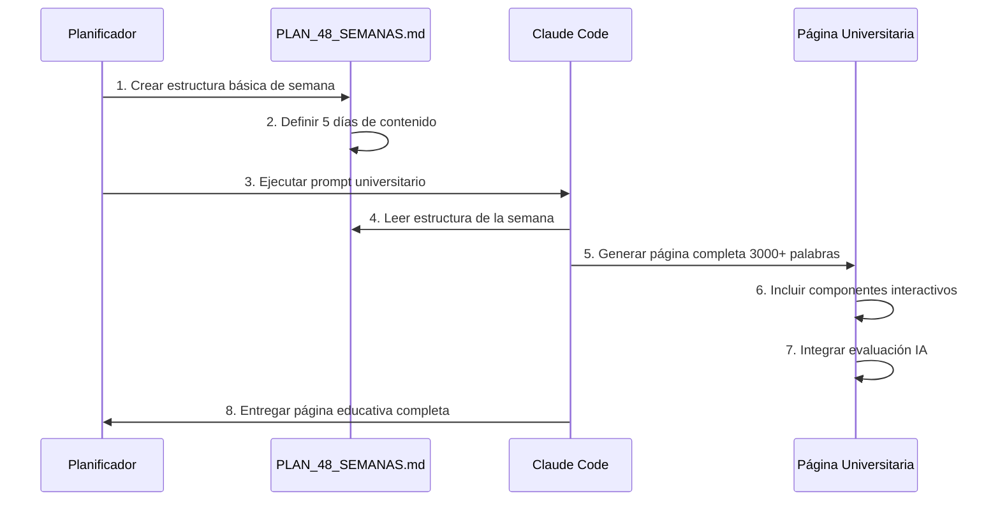

# 🎓 **PLANTILLA OFICIAL: Creación de Contenido Educativo**

## 📋 **PASO 1: Planificación en PLAN_48_SEMANAS.md**

### **Formato Estándar:**
```markdown
#### ✅ **Tarea FX-MX-SX: [TÍTULO DE LA SEMANA]**
*[Contexto/conexión con contenido actual]*

**🎯 Objetivo**: [Objetivo específico y medible]

**📚 Contenido a expandir**:
- **Día 1**: [Concepto base] + [Aplicación práctica]
- **Día 2**: [Concepto intermedio] + [Implementación]
- **Día 3**: [Concepto avanzado] + [Integración]
- **Día 4**: [Concepto especializado] + [Optimización]
- **Día 5**: [Síntesis] + [Preparación siguiente tema]

**🔧 Tecnologías**: [Lista de tecnologías específicas]
**📦 Entregables**: [Código funcional] + [Tests] + [Documentación]
```

### **Ejemplo Completo:**
```markdown
#### ✅ **Tarea F1-M1-S1: Configuración del Entorno y Fundamentos**
*Expansión del contenido actual de Semana 1*

**🎯 Objetivo**: Establecer base sólida de desarrollo y principios fundamentales

**📚 Contenido a expandir**:
- **Día 1**: Setup inicial del proyecto + Principios de Clean Code
- **Día 2**: Estructura de directorios + Configuración de Git
- **Día 3**: Crear task.schema.json + Validación de datos
- **Día 4**: Tests básicos con Jest + Primer agente mock
- **Día 5**: Integración y documentación JSDoc

**🔧 Tecnologías**: Node.js, Git, Jest, JSON Schema, JSDoc
**📦 Entregables**: Proyecto configurado + Schema + Tests básicos
```

---

## 🎓 **PASO 2: Expansión Universitaria con Claude Code**

### **Comando de Ejecución:**
```bash
# En tu terminal
claude-code "Crear página educativa universitaria para [TAREA-ID] 
siguiendo PROMPT_EJECUTABLE_CLAUDE_CODE.md con nivel de detalle 
universitario, 3000+ palabras, 4 ejemplos progresivos, componentes 
interactivos y evaluación IA integrada"
```

### **Estructura de Página Generada:**
```tsx
// src/app/agencia/mes-X/semana-Y/dia-Z/page.tsx
'use client'

import React, { useState } from 'react'
import Link from 'next/link'
import { Card, CardContent, CardHeader, CardTitle } from '@/components/ui/card'
import { Button } from '@/components/ui/button'
import { 
  BookOpen, Code, Brain, CheckCircle, PlayCircle, Target,
  Settings, GitBranch, FileCode, Zap, Award, TrendingUp,
  Home, ChevronRight
} from 'lucide-react'

// Interfaces estándar
interface SectionProps {
  onComplete: () => void
  onNext?: () => void
}

interface TaskHeaderProps {
  taskId: string
  title: string
  description: string
  progress: number
  completedSections: string[]
  onSectionChange: (section: string) => void
  activeSection: string
}

// Breadcrumbs Component con navegación completa
function Breadcrumbs() {
  return (
    <nav className="bg-gray-900/30 backdrop-blur-sm border-b border-gray-800/50">
      <div className="container mx-auto px-4 py-3">
        <div className="flex items-center space-x-2 text-sm">
          <Link 
            href="/agencia" 
            className="flex items-center gap-1 text-blue-400 hover:text-blue-300 transition-colors hover:underline"
          >
            <Home className="w-4 h-4" />
            Dashboard
          </Link>
          <ChevronRight className="w-4 h-4 text-gray-500" />
          <Link 
            href="/agencia/mes-X" 
            className="text-green-400 hover:text-green-300 transition-colors hover:underline"
          >
            Mes X: [Título del Mes]
          </Link>
          <ChevronRight className="w-4 h-4 text-gray-500" />
          <Link 
            href="/agencia/mes-X/semana-Y" 
            className="text-purple-400 hover:text-purple-300 transition-colors hover:underline"
          >
            Semana Y: [Título de la Semana]
          </Link>
          <ChevronRight className="w-4 h-4 text-gray-500" />
          <span className="text-white font-medium">Día Z: [Título del Día]</span>
        </div>
        
        {/* Quick Navigation */}
        <div className="flex items-center gap-4 mt-2">
          <Link 
            href="/agencia" 
            className="text-xs text-gray-400 hover:text-gray-300 transition-colors hover:underline"
          >
            ← Volver al roadmap visual
          </Link>
          <span className="text-xs text-gray-600">|</span>
          <Link 
            href="/agencia/mes-X" 
            className="text-xs text-gray-400 hover:text-gray-300 transition-colors hover:underline"
          >
            📚 Ver todas las lecciones del Mes X
          </Link>
          <span className="text-xs text-gray-600">|</span>
          <Link 
            href="/agencia/mes-X/semana-Y" 
            className="text-xs text-gray-400 hover:text-gray-300 transition-colors hover:underline"
          >
            📅 Ver cronograma de la Semana Y
          </Link>
        </div>
      </div>
    </nav>
  )
}

// TaskHeader Component con navegación por secciones
function TaskHeader({ 
  taskId, title, description, progress, 
  completedSections, onSectionChange, activeSection 
}: TaskHeaderProps) {
  const sections = [
    { id: 'teoria', label: 'Teoría Expandida', icon: BookOpen },
    { id: 'ejemplos', label: 'Ejemplos Progresivos', icon: Code },
    { id: 'practica', label: 'Práctica Interactiva', icon: PlayCircle },
    { id: 'evaluacion', label: 'Evaluación IA', icon: Brain },
    { id: 'proyecto', label: 'Proyecto Final', icon: Target }
  ]

  return (
    <div className="sticky top-0 z-50 bg-gray-900/90 backdrop-blur-lg border-b border-blue-500/30">
      <div className="container mx-auto px-4 py-4">
        <div className="flex items-center justify-between">
          <div>
            <h1 className="text-3xl font-bold text-white flex items-center gap-3">
              <Settings className="w-8 h-8 text-green-400" />
              {taskId}: {title}
            </h1>
            <p className="text-blue-300 mt-1">{description}</p>
          </div>
          <div className="flex items-center gap-4">
            <div className="text-right">
              <p className="text-sm text-gray-400">Progreso</p>
              <p className="text-2xl font-bold text-green-400">{progress.toFixed(0)}%</p>
            </div>
            <div className="w-32 h-2 bg-gray-700 rounded-full overflow-hidden">
              <div 
                className="h-full bg-gradient-to-r from-green-500 to-blue-500 transition-all duration-500"
                style={{ width: `${progress}%` }}
              />
            </div>
          </div>
        </div>
        
        {/* Navegación por secciones */}
        <div className="flex gap-2 mt-4 flex-wrap">
          {sections.map(section => (
            <Button
              key={section.id}
              variant={activeSection === section.id ? 'default' : 'outline'}
              onClick={() => onSectionChange(section.id)}
              className={`flex items-center gap-2 ${
                completedSections.includes(section.id) 
                  ? 'border-green-500 text-green-400' 
                  : ''
              }`}
            >
              <section.icon className="w-4 h-4" />
              {section.label}
              {completedSections.includes(section.id) && (
                <CheckCircle className="w-4 h-4 text-green-400" />
              )}
            </Button>
          ))}
        </div>
      </div>
    </div>
  )
}

export default function FXMXSXDZ_Page() {
  const [activeSection, setActiveSection] = useState('teoria')
  const [completedSections, setCompletedSections] = useState<string[]>([])
  const [progress, setProgress] = useState(0)

  // Marcar sección como completada
  const completeSection = (section: string) => {
    if (!completedSections.includes(section)) {
      const newCompleted = [...completedSections, section]
      setCompletedSections(newCompleted)
      setProgress((newCompleted.length / 5) * 100)
    }
  }

  return (
    <div className="min-h-screen bg-gradient-to-br from-gray-900 via-blue-900 to-purple-900">
      {/* Breadcrumbs Navigation */}
      <Breadcrumbs />
      
      {/* Task Header */}
      <TaskHeader 
        taskId="FX-MX-SX-DZ" 
        title="[Título específico del día]"
        description="[Descripción breve de la lección]"
        progress={progress}
        completedSections={completedSections}
        onSectionChange={setActiveSection}
        activeSection={activeSection}
      />

      <div className="container mx-auto px-4 py-8">
        {/* SECCIÓN 1: TEORÍA EXPANDIDA (40% - 1200+ palabras) */}
        {activeSection === 'teoria' && (
          <TheorySection 
            onComplete={() => completeSection('teoria')}
            onNext={() => setActiveSection('ejemplos')}
          />
        )}

        {/* SECCIÓN 2: EJEMPLOS PROGRESIVOS (25% - 4 ejemplos) */}
        {activeSection === 'ejemplos' && (
          <ExamplesSection 
            onComplete={() => completeSection('ejemplos')}
            onNext={() => setActiveSection('practica')}
          />
        )}

        {/* SECCIÓN 3: PRÁCTICA INTERACTIVA (25%) */}
        {activeSection === 'practica' && (
          <PracticeSection 
            onComplete={() => completeSection('practica')}
            onNext={() => setActiveSection('evaluacion')}
          />
        )}

        {/* SECCIÓN 4: EVALUACIÓN IA (10%) */}
        {activeSection === 'evaluacion' && (
          <EvaluationSection 
            onComplete={() => completeSection('evaluacion')}
            onNext={() => setActiveSection('proyecto')}
          />
        )}

        {/* SECCIÓN 5: PROYECTO FINAL */}
        {activeSection === 'proyecto' && (
          <ProjectSection 
            onComplete={() => completeSection('proyecto')}
          />
        )}
      </div>
    </div>
  )
}

// Componentes de sección (implementar según el contenido específico)
function TheorySection({ onComplete, onNext }: SectionProps) { /* ... */ }
function ExamplesSection({ onComplete, onNext }: SectionProps) { /* ... */ }
function PracticeSection({ onComplete, onNext }: SectionProps) { /* ... */ }
function EvaluationSection({ onComplete, onNext }: SectionProps) { /* ... */ }
function ProjectSection({ onComplete }: Omit<SectionProps, 'onNext'>) { /* ... */ }
```

---

## 📊 **MÉTRICAS DE CALIDAD OBLIGATORIAS**

### **Contenido:**
- ✅ **Mínimo 3000 palabras** de contenido educativo
- ✅ **Teoría universitaria** con fundamentos profundos
- ✅ **4 ejemplos progresivos** (básico → producción)
- ✅ **Casos reales** de empresas como OpenAI, Google, etc.

### **Interactividad:**
- ✅ **Componentes React** 100% funcionales
- ✅ **Editores de código** con validación tiempo real
- ✅ **Simuladores** específicos del tema
- ✅ **Evaluación IA** adaptativa

### **Experiencia de Usuario:**
- ✅ **Responsive design** perfecto
- ✅ **Navegación fluida** entre secciones
- ✅ **Breadcrumbs clickeables** en todos los niveles
- ✅ **Progress tracking** detallado
- ✅ **Tiempo estimado** 2-3 horas por día

### **Navegación Requerida:**
- ✅ **Breadcrumbs completos**: Dashboard → Mes → Semana → Día
- ✅ **Enlaces de retorno**: Volver al roadmap, ver mes completo, ver semana
- ✅ **Navegación por secciones**: 5 botones (Teoría, Ejemplos, Práctica, Evaluación, Proyecto)
- ✅ **Estados visuales**: Completado ✅, Actual ▶️, Pendiente ⭕
- ✅ **Progreso en tiempo real**: Barra de progreso actualizada

---

## 🧭 **NAVEGACIÓN: Componente Breadcrumbs Reutilizable**

### **Ubicación del Componente:**
```
src/components/ui/breadcrumbs.tsx
```

### **Uso en Páginas Nuevas:**
```tsx
import { Breadcrumbs } from '@/components/ui/breadcrumbs'

// En el JSX de la página
<Breadcrumbs 
  items={[
    { label: 'Dashboard', href: '/agencia' },
    { label: 'Mes X: [Título]', href: '/agencia/mes-X' },
    { label: 'Semana Y: [Título]', href: '/agencia/mes-X/semana-Y' },
    { label: 'Día Z: [Título]', isActive: true }
  ]}
  quickLinks={[
    { label: '← Volver al roadmap visual', href: '/agencia' },
    { label: '📚 Ver todas las lecciones del Mes X', href: '/agencia/mes-X' },
    { label: '📅 Ver cronograma de la Semana Y', href: '/agencia/mes-X/semana-Y' }
  ]}
/>
```

### **Configuración por Nivel:**

#### **Página de Mes:**
```tsx
<Breadcrumbs 
  items={[
    { label: 'Dashboard', href: '/agencia' },
    { label: 'Mes X: [Título]', isActive: true }
  ]}
  quickLinks={[
    { label: '← Volver al roadmap visual', href: '/agencia' }
  ]}
/>
```

#### **Página de Semana:**
```tsx
<Breadcrumbs 
  items={[
    { label: 'Dashboard', href: '/agencia' },
    { label: 'Mes X: [Título]', href: '/agencia/mes-X' },
    { label: 'Semana Y: [Título]', isActive: true }
  ]}
  quickLinks={[
    { label: '← Volver al roadmap visual', href: '/agencia' },
    { label: '📚 Ver todas las semanas del Mes X', href: '/agencia/mes-X' }
  ]}
/>
```

#### **Página de Día:**
```tsx
<Breadcrumbs 
  items={[
    { label: 'Dashboard', href: '/agencia' },
    { label: 'Mes X: [Título]', href: '/agencia/mes-X' },
    { label: 'Semana Y: [Título]', href: '/agencia/mes-X/semana-Y' },
    { label: 'Día Z: [Título]', isActive: true }
  ]}
  quickLinks={[
    { label: '← Volver al roadmap visual', href: '/agencia' },
    { label: '📚 Ver todas las lecciones del Mes X', href: '/agencia/mes-X' },
    { label: '📅 Ver cronograma de la Semana Y', href: '/agencia/mes-X/semana-Y' }
  ]}
/>
```

---

## 🎯 **WORKFLOW COMPLETO**



---

## 🚀 **PRÓXIMOS PASOS RECOMENDADOS**

1. **Crear F1-M1-S1-D1** (Setup inicial del proyecto)
2. **Crear F1-M1-S1-D2** (Estructura de directorios)
3. **Crear F1-M1-S1-D4** (Tests básicos con Jest)
4. **Crear F1-M1-S1-D5** (Documentación JSDoc)

### **Comando Específico:**
```bash
claude-code "Crear página educativa universitaria para F1-M1-S1-D1 
'Setup inicial del proyecto + Principios de Clean Code' siguiendo 
PROMPT_EJECUTABLE_CLAUDE_CODE.md con contenido universitario completo"
```

**¿Quieres que procedamos con la creación de F1-M1-S1-D1 siguiendo esta plantilla?**
