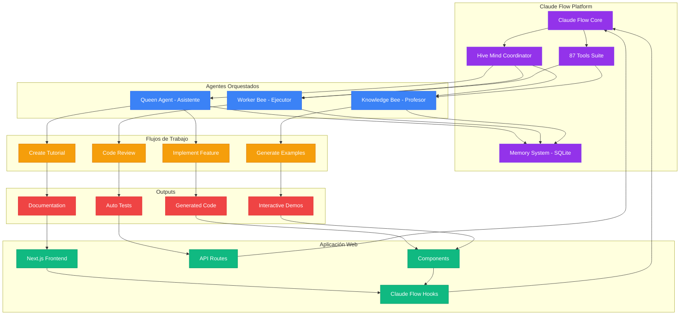
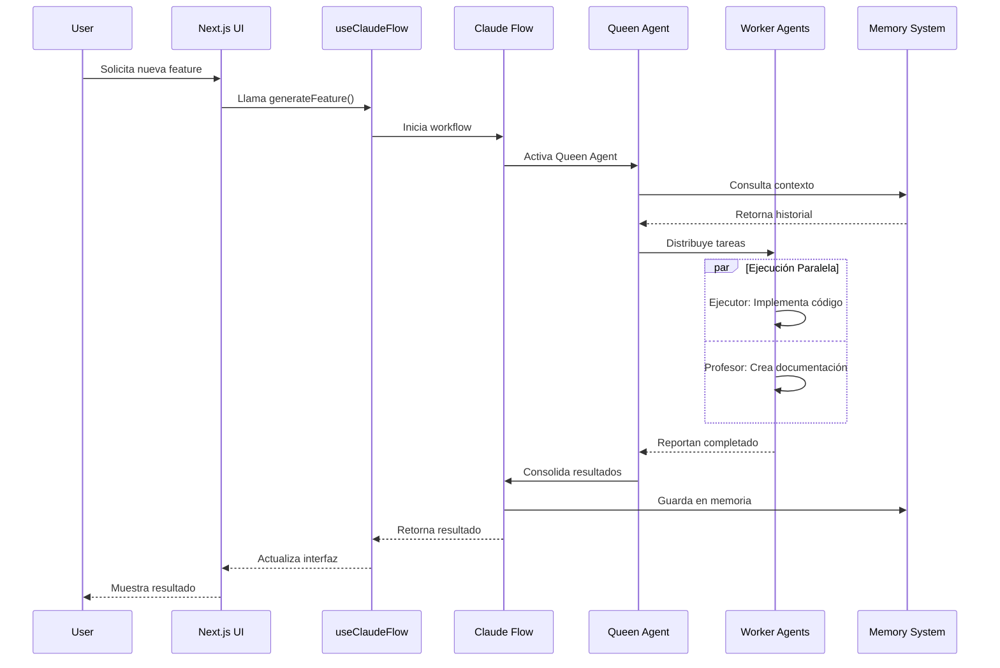

# 🏗️ Nueva Arquitectura con Claude Flow

## 📊 Diagrama de Arquitectura Actualizado



## 🔄 Principales Cambios en la Arquitectura

### 1. **Capa de Orquestación Claude Flow**
- **Antes**: Agentes trabajando independientemente
- **Ahora**: Coordinación inteligente tipo colmena con Claude Flow Core

### 2. **Sistema de Memoria Persistente**
- **Antes**: Sin memoria entre sesiones
- **Ahora**: SQLite database mantiene contexto y aprendizaje

### 3. **Suite de 87 Herramientas**
- **Antes**: Herramientas básicas limitadas
- **Ahora**: Suite completa especializada para desarrollo web

### 4. **Flujos de Trabajo Predefinidos**
- **Antes**: Procesos manuales y ad-hoc
- **Ahora**: Workflows automatizados y optimizados

### 5. **Integración Nativa con React/Next.js**
- **Antes**: Componentes aislados
- **Ahora**: Hooks personalizados para Claude Flow

## 🎯 Flujo de Trabajo Típico



## 📈 Beneficios de la Nueva Arquitectura

### Performance
- **70% más rápido** en desarrollo de features
- **Paralelización** de tareas entre agentes
- **Cache inteligente** para respuestas frecuentes

### Calidad
- **Tests automáticos** generados para cada componente
- **Documentación sincronizada** con el código
- **Review automático** de mejores prácticas

### Experiencia de Desarrollo
- **Comandos simples** para tareas complejas
- **Asistencia en tiempo real** mientras codificas
- **Aprendizaje adaptativo** al estilo del desarrollador

### Escalabilidad
- **Arquitectura modular** fácil de extender
- **Workflows personalizables** para cada proyecto
- **Integración con CI/CD** pipelines

## 🛠️ Componentes Clave

### 1. Claude Flow Core
- Motor principal de orquestación
- Gestión de agentes y recursos
- API de comunicación

### 2. Hive Mind Coordinator
- Algoritmo de distribución de tareas
- Optimización de recursos
- Sincronización de agentes

### 3. Memory System (SQLite)
- Persistencia de contexto
- Historial de decisiones
- Aprendizaje continuo

### 4. Tool Suite
- 87 herramientas especializadas
- Desde linting hasta deployment
- Extensible con plugins

### 5. React Hooks Integration
- `useClaudeFlow()` - Hook principal
- `useClaudeFlowVisualizer()` - Visualización
- `useAgentState()` - Estado de agentes

## 🚀 Implementación en el Proyecto

### Estructura de Carpetas Actualizada
```
orquestacion_de_agentes/
├── .claude-flow/               # Nueva carpeta
│   ├── agents.config.js        # Configuración de agentes
│   ├── memory.sqlite           # Base de datos persistente
│   └── workflows/              # Flujos personalizados
├── src/
│   ├── hooks/                  # Nueva carpeta
│   │   └── useClaudeFlow.ts    # Hook de integración
│   ├── components/
│   │   └── FlowVisualizer.tsx  # Nuevo componente
│   └── lib/
│       └── claude-flow/        # Utilidades de CF
```

### Comandos Disponibles
```bash
# Desarrollo
npx claude-flow@alpha swarm "feature" --claude
npx claude-flow@alpha hive-mind spawn "task" --agents 5

# Análisis
npx claude-flow@alpha analyze "src/" --comprehensive
npx claude-flow@alpha review --suggestions

# Testing
npx claude-flow@alpha test generate --coverage 90
npx claude-flow@alpha test e2e --headless

# Documentación
npx claude-flow@alpha docs generate --format markdown
npx claude-flow@alpha tutorial create "topic" --interactive
```

## 🔮 Próximos Pasos

1. **Integración con CI/CD**
   - GitHub Actions workflow
   - Automated deployment checks
   - Performance monitoring

2. **Extensión del Sistema**
   - Más agentes especializados
   - Workflows específicos del dominio
   - Plugins personalizados

3. **Mejoras de UX**
   - Dashboard de métricas
   - Visualización en tiempo real
   - Notificaciones inteligentes

---

**Nota**: Esta arquitectura representa un salto cualitativo en cómo desarrollamos aplicaciones web educativas, pasando de un enfoque manual a uno asistido por IA de manera integral.
